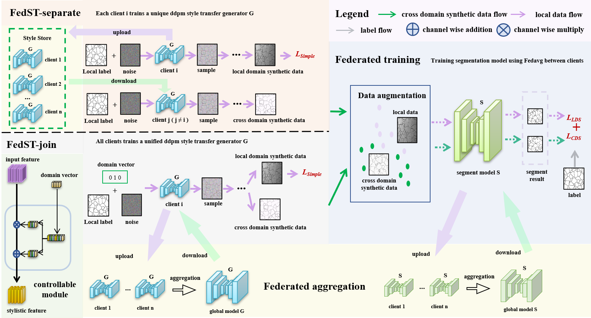

# FedST
A federated image segmentation method based on style transfer

Implementation of the paper accepted by AAAI 2024: [FedST: Federated Style Transfer Learning for Non-IID image segmentation](https://ojs.aaai.org/index.php/AAAI/article/view/28199)

**Abstract:** Federated learning collaboratively trains machine learning models among different clients while keeping data privacy and has become the mainstream for breaking data silos. However, the non-independently and identically distribution (i.e., Non-IID) characteristic of different image domains among different clients reduces the benefits of federated learning and has become a bottleneck problem restricting the accuracy and generalization of federated models. In this work, we propose a novel federated image segmentation method based on style transfer, FedST, by using a denoising diffusion probabilistic model to achieve feature disentanglement and image synthesis of cross-domain image data between multiple clients. Thus it can share style features among clients while protecting structure features of image data, which effectively alleviates the influence of the Non-IID phenomenon. 


**Overview of the proposed federated style transfer：** The FedST-separate and FedST-join are two variants. The former lets each client trains a unique style transfer generator and constructs a unified style store to save them. And it exchanges generators to let each client generate cross-domain data using their own local label. While the latter is equipped with a global controllable module to train a unified style transfer generator around all clients using the FedAvg method. And each client can modify the domain vector to generate cross-domain data. Finally, both of them use FedAvg to train the target image segmentation model using local and synthetic data.



## Dependencies & Environment
> This experiment was conducted in the following environment and platform, while other environments and platforms have not been tested.
- Python=3.6.9
- Pytorch=1.8.1

- Platform: Tesla V100-SXM2-32GB

## Usage

- Prepare your dataset and place them under the `dataset` folder. The file structure is similar to the following shown

  ```
  Name of your dataset
  ├─test
  │  ├─real_image
  │  │  ├─0
  │  │  └─1
  │  └─real_label
  │      ├─0
  │      └─1
  └─train
      ├─fake_image
      │  ├─0
      │  └─1
      ├─real_image
      │  ├─0
      │  └─1
      └─real_label
          ├─0
          └─1
  ```

- Train style transfer generator to generate *Synthetic Cross-Domain Data* and place them under the `train/fake_image` folder as shown above.
> FedST-Separate: reference: https://github.com/Janspiry/Palette-Image-to-Image-Diffusion-Models
> 
> FedST-Join: reference: [./scripts/train_test.sh](./scripts/train_test.sh)

- Train and Test Federated Learning Segmentation Model
> Reference: [./scripts/train_test.sh](./scripts/train_test.sh)


## Citation
Ma B, Yin X, Tan J, et al. FedST: Federated Style Transfer Learning for Non-IID Image Segmentation[C]//Proceedings of the AAAI Conference on Artificial Intelligence. 2024, 38(5): 4053-4061.
